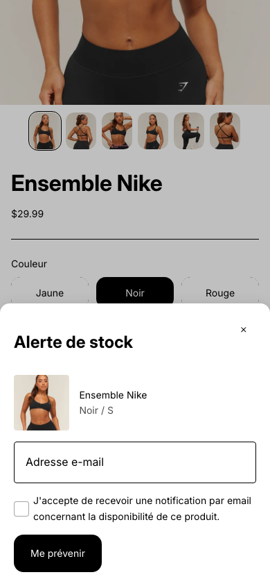
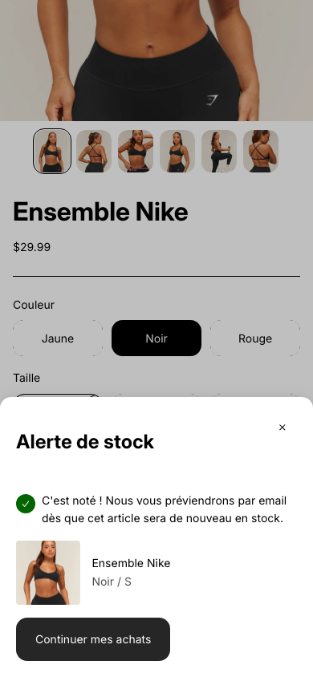
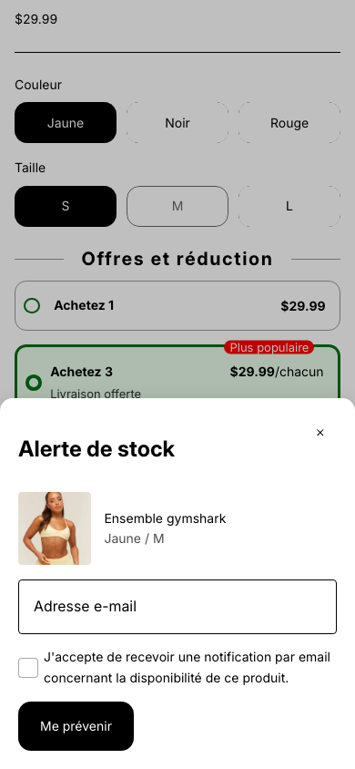

<a href="README.fr.md">Lire en français</a>

# Shopify Back in Stock Alert — automatic notify-me popup

A theme-native "notify me" panel for Shopify product pages: the moment a
customer selects a variant that's out of stock, a fully custom panel opens on
its own — no button to click — letting them leave an email to be notified
when it's back.

Built for the **Shopify Horizon** theme. No custom backend to host — the
panel is 100% your own design, storage and email delivery are delegated to a
third-party app's API (kept swappable, see `docs/integration-guide.md`).

| Panel open (mobile) | Confirmation |
|---|---|
|  |  |

## Features

- Opens automatically on variant selection — right-anchored full-height panel
  on desktop, bottom-sheet sized to its content on mobile, dimmed backdrop in
  both cases
- Availability is read from Liquid's own already-rendered output, never
  re-derived in JavaScript — no risk of drifting from the theme's real source
  of truth (see `docs/gotchas.md`, #2)
- Fully theme-editor configurable text: popup title, submit button, consent
  checkbox wording, confirmation message
- Fully bilingual out of the box (English + French); add more languages by
  extending the locale files
- Accessible: focus-managed native `<dialog>`, `aria-live` status region,
  keyboard/Escape/click-outside dismissal all handled by the platform

## Bonus: Bundle Selector integration

Also enhances [shopify-bundle-selector](https://github.com/pteyo032/shopify-bundle-selector):
if one or more units in a selected bundle tier are out of stock, clicking
"Add to cart" opens this same popup with every unavailable unit listed —one
email covers all of them — instead of a generic error.

| Bundle tier with an out-of-stock unit |
|---|
|  |

## Repository contents

This repo contains **only the custom code for this feature** — not the full
Horizon theme, which belongs to Shopify. You drop these files into an
existing Horizon (or Horizon-based) theme.

| Path | What it is |
|---|---|
| `blocks/back-in-stock-alert.liquid` | The block — markup (single-item and multi-item list views), settings schema, scoped CSS |
| `assets/back-in-stock-alert.js` | The `<back-in-stock-alert-component>` web component — listens for variant changes, opens/closes the panel, handles submission |
| `assets/bundle-selector.js` | Enhanced version of the sibling repo's file — optional, only needed if you also use the Bundle Selector |
| `locales/*.json`, `locales/*.schema.json` | English + French translations (storefront text and editor labels) |
| `docs/integration-guide.md` | Step-by-step install instructions, including wiring up a real notification backend |
| `docs/gotchas.md` | Technical pitfalls discovered while building this, so you don't re-hit them |

## Quick start

1. Copy `blocks/back-in-stock-alert.liquid` and `assets/back-in-stock-alert.js`
   into your theme.
2. Add the translation keys from `locales/` to your own locale files.
3. Add the **Back in Stock Alert** block to your product page from the theme
   editor.
4. Wire up a real backend for storage + email delivery — see
   `docs/integration-guide.md`, step 5. This is the one part every store needs
   to decide for itself.

## Known limitation: a theme can't do this alone

A theme cannot safely store "notify me" signups or send emails by itself —
writing that data would require exposing an Admin API token in public
storefront JavaScript, which anyone could steal and use to modify store data.
This block builds the entire front-end; you still need a backend (a
third-party app's API, or your own) to actually store requests and send the
notification. See `docs/integration-guide.md` for the trade-offs.

## License

MIT — see `LICENSE`.
